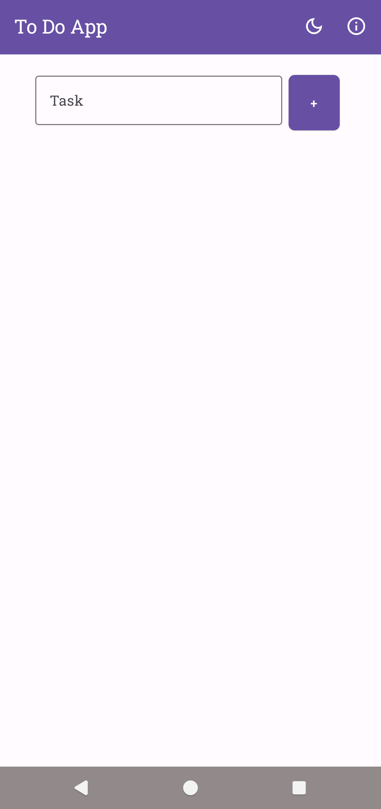
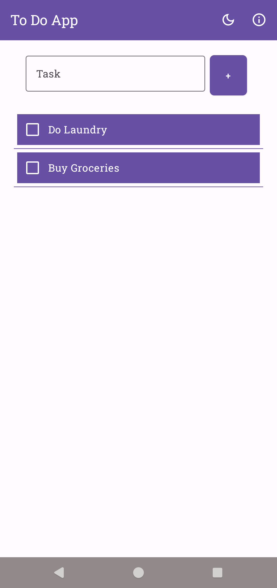
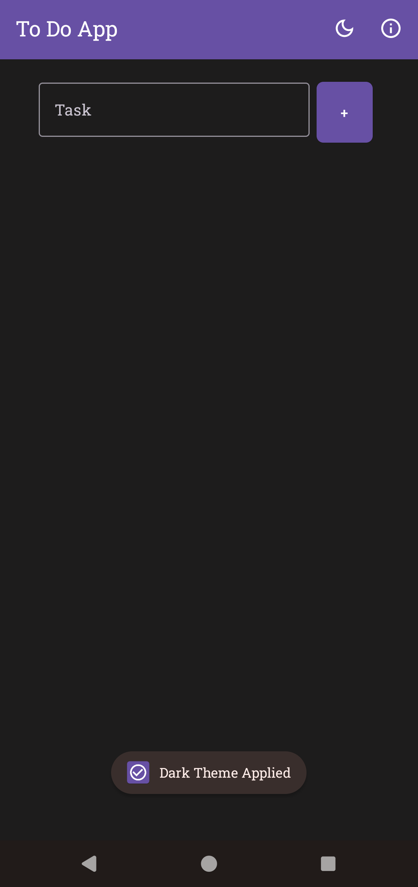
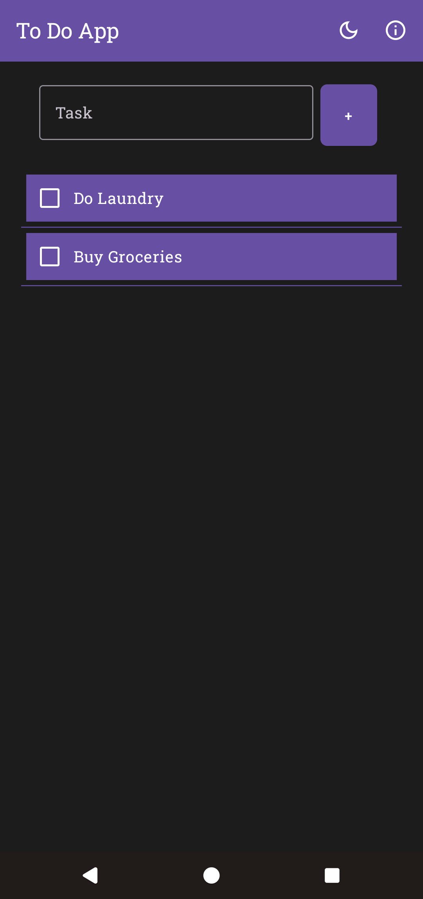

# To Do App

A minimalist yet functional **To Do list app** built using **Kotlin** and **Jetpack Compose**. This app allows you to create and manage tasks with a sleek UI, persistent local storage, and support for light/dark themes.
---

<a href = https://github.com/Govind-Sankar/To-Do-App/releases>

</a>

## 📱 Features

- 📝 Add and delete tasks
- 🌙 Toggle between Light and Dark mode
- 🎨 Modern UI using Material 3 and Jetpack Compose
- 🙌 Simple and clean design

## 🖼️ Screenshots







## 📦 How to Install

1. Download the latest APK from the [Releases](https://github.com/Govind-Sankar/To-Do-App/releases) section.
2. Transfer the APK to your Android device.
3. Enable installation from unknown sources.
4. Open the APK and install it.

## 🚀 Getting Started (for developers)

1. Clone this repo:
   ```bash
   git clone https://github.com/Govind-Sankar/To-Do-App.git

## 📄 License

This project is licensed under the [MIT License](LICENSE).

Feel free to use, modify, and distribute it. See the LICENSE file for details.
